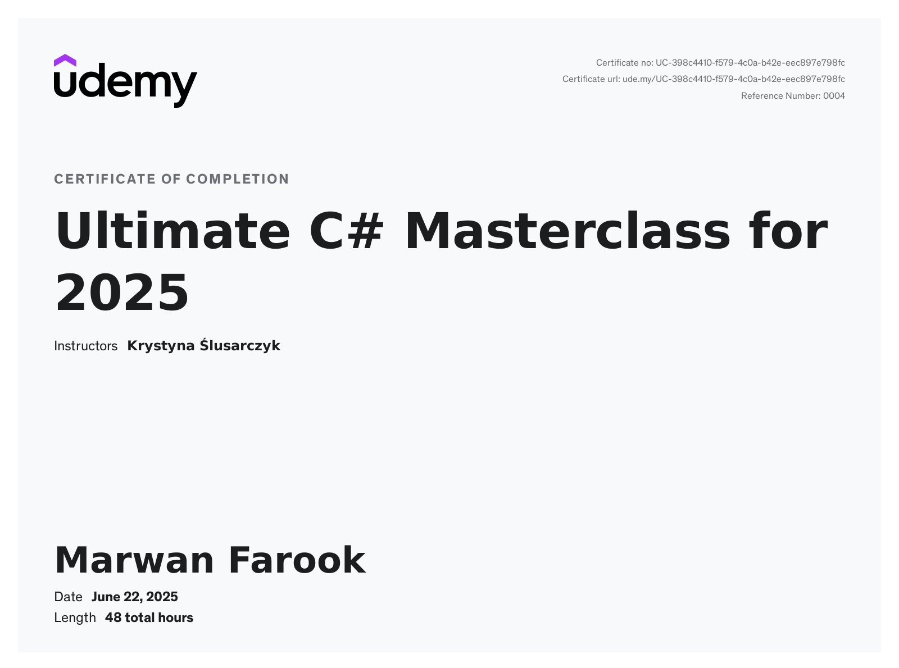

# Hi there! 👋 I'm Marwan Mohamed Farook

## About Me
👨‍💻 Software Developer specializing in C# with a passion for Game Development
🎓 Recently completed 47+ hours of advanced C# training and comprehensive Data Structures & Algorithms course
🎮 Currently learning Unity to combine programming skills with creative game design
🔧 Building projects that showcase OOP principles, design patterns, and algorithmic thinking
🌱 Excited to create engaging games while writing efficient, maintainable code

## 📜 Certifications
- **Advanced C# Programming** - Udemy, June 2025  
  

## 🔧 Technologies & Tools
| Languages | Game Engine | Tools          | Concepts                          |
|-----------|-------------|----------------|-----------------------------------|
| C#        | Unity       | Visual Studio, Git | OOP, Design Patterns, DSA, SOLID |

## 🌱 Currently Learning
- Unity Game Development
- Advanced C# concepts
- Game design principles
- SOLID Principles implementation

## 📊 Coding Practice
- Practicing algorithmic problem solving

## 🎯 Goals
- Build engaging Unity games
- Master game development best practices
- Contribute to open-source game development tools
- Master advanced design patterns for scalable game architecture
- Implement SOLID principles and clean code architecture in all projects

## 📫 Connect with Me

 
## 📊 GitHub Stats

## ⚡ Fun Fact
We Don't Play A Game, We Make It! 🎮
